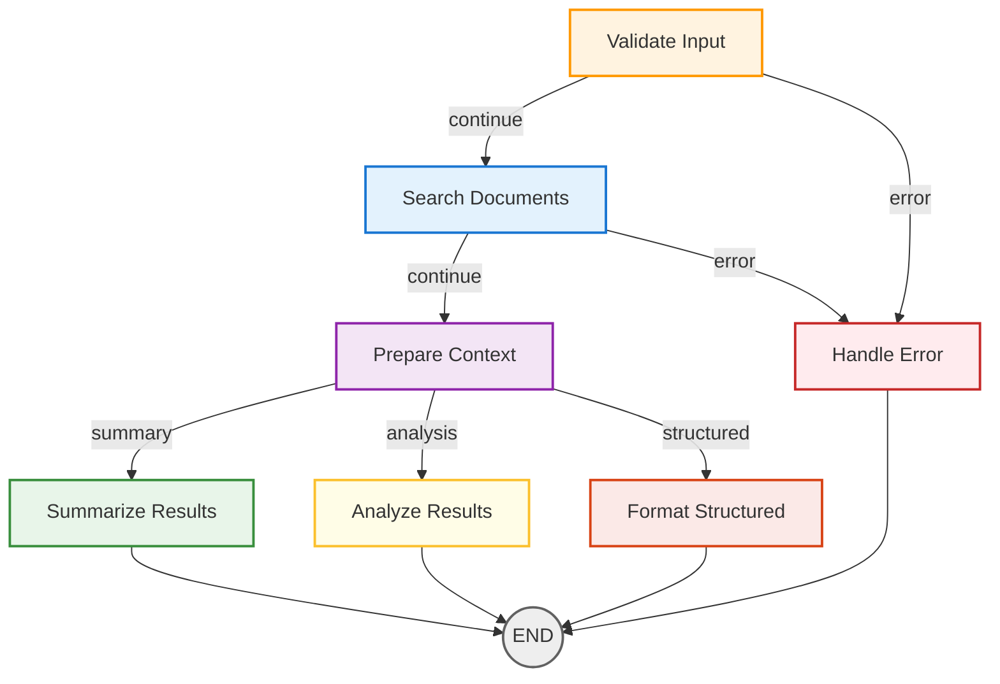

# Azure AI Search MCP Server 🔍🤖

<!-- SEO Keywords: Azure AI Search, MCP Server, Claude Desktop, LangGraph, RAG, Retrieval Augmented Generation, Document Search, AI Search Integration, Model Context Protocol, Enterprise Search -->

[](https://www.python.org/downloads/)
[](https://azure.microsoft.com/en-us/services/search/)
[](https://langchain-ai.github.io/langgraph/)
[](https://modelcontextprotocol.io/)

**An intelligent Model Context Protocol (MCP) server for Azure AI Search integration with Claude Desktop** - Transform enterprise document search into natural AI conversations using LangGraph workflows, Google Gemini, and advanced retrieval-augmented generation (RAG).

**🔥 Keywords**: Azure Cognitive Search, MCP Server, Claude Desktop Integration, LangGraph AI Workflows, Document Retrieval, Enterprise Search, RAG Implementation, AI-Powered Search, Conversational AI, Knowledge Management

> **🚀 Perfect for**: Enterprise search solutions, document analysis platforms, knowledge management systems, AI-powered research tools, intelligent document retrieval, conversational search interfaces, and RAG (Retrieval-Augmented Generation) applications.

**Requirements**: Python 3.8+ | Azure AI Search Service | Claude Desktop | Google Gemini API (optional)

## Features

- **🔍 Azure AI Search Integration**: Connect to your Azure AI Search index
- **🔄 LangGraph Chain**: Intelligent query processing and context retrieval  
- **🧠 Google Gemini Integration**: Enhanced document formatting, summarization, and analysis
- **🎨 Enhanced Visualizations**: Grandalf layouts, Mermaid diagrams, and ASCII art
- **📊 LangSmith Tracing**: Full observability and debugging of chain executions
- **🐍 MCP Protocol**: Expose functionality as tools that Claude can use directly
- **⚙️ Configurable**: Easy setup with environment variables
- **🔧 Pydantic Validation**: Type-safe configuration and data validation
- **🌍 Environment Management**: Secure credential handling with python-dotenv
- **🎭 Persona-Driven Responses**: Two distinct AI personas for different output styles
- **📝 JSON-Based Prompts**: Easily editable prompt templates
- **🧪 Comprehensive Testing**: Full test suite with multiple scenarios

## Table of Contents

- [Technical Stack](#technical-stack)
- [Quick Setup](#quick-setup)
- [Configuration](#configuration)
- [Google Gemini Setup](#google-gemini-setup)
- [Claude Desktop Integration](#claude-desktop-integration)
- [Project Structure](#project-structure)
- [Architecture Overview](#architecture-overview)
- [Available Tools](#available-tools)
- [Visualization Tools](#visualization-tools)
- [Testing](#testing)
- [Development](#development)
- [LangSmith Monitoring](#langsmith-monitoring)
- [Troubleshooting](#troubleshooting)

## Technical Stack

### Core Technologies
- **Python 3.8+**: Modern Python with asyncio support
- **LangChain/LangGraph**: AI workflow orchestration and state management
- **Azure AI Search**: Cloud-based document indexing and retrieval
- **Google Gemini**: Large language model for content processing
- **Model Context Protocol (MCP)**: Standard protocol for AI tool integration

### Configuration & Validation
- **Pydantic v2**: Type-safe configuration models with automatic validation
- **python-dotenv**: Environment variable management and secrets handling
- **Structured Logging**: Comprehensive error tracking and debugging

### Visualization & Development
- **Grandalf**: Advanced graph layout algorithms for LangGraph visualization
- **Mermaid**: Professional diagram generation for documentation
- **LangSmith**: Observability and tracing for AI chain executions
- **Pytest**: Comprehensive testing framework with async support

## Quick Setup

1. **Clone and Install**:
   ```bash
   git clone https://github.com/codewith-mm/langgraph-claude-azure-mcp.git
   cd langgraph-claude-azure-mcp
   pip install -e .
   ```

2. **Configure Environment**:
   Copy `.env.example` to `.env` and fill in your credentials:
   ```bash
   # On Windows (PowerShell):
   Copy-Item .env.example .env
   # On macOS/Linux:
   cp .env.example .env
   ```

3. **Run the MCP Server**:
   ```bash
   azure-search-mcp
   ```

## Configuration

Create a `.env` file in the project root with the following variables:

```env
# Azure AI Search
AZURE_SEARCH_ENDPOINT=https://your-search-service.search.windows.net
AZURE_SEARCH_API_KEY=your-search-admin-key
AZURE_SEARCH_INDEX_NAME=your-index-name

# Google Gemini (for enhanced AI processing)
GOOGLE_API_KEY=your-google-api-key
GEMINI_MODEL=gemini-1.5-flash
GEMINI_TEMPERATURE=0.1

# LangSmith (for tracing and debugging)
LANGCHAIN_TRACING_V2=true
LANGCHAIN_ENDPOINT=https://api.smith.langchain.com
LANGCHAIN_API_KEY=your-langsmith-api-key
LANGCHAIN_PROJECT=azure-search-mcp
```

## Google Gemini Setup

1. **Get API Key**: Visit [Google AI Studio](https://makersuite.google.com/app/apikey)
2. **Create API Key**: Generate a new API key for your project
3. **Add to Environment**: Set `GOOGLE_API_KEY` in your `.env` file

The server will automatically:
- Use Google Gemini for document formatting and summarization when API key is configured
- Fall back to basic formatting if no API key is provided
- Create proper LangChain chains that appear in LangSmith tracing

## Claude Desktop Integration

### Step 1: Locate Claude Desktop Configuration


Claude Desktop stores its configuration in a JSON file. Example (Windows):
```
%APPDATA%/Claude/claude_desktop_config.json
```

### Step 2: MCP Server Configuration


Add this configuration to your Claude Desktop config file (update paths as needed for your environment):
```json
{
   "mcpServers": {
      "azure-search-mcp": {
         "command": "python",
         "args": [
            "-m",
            "azure_search_mcp"
         ],
         "cwd": "../langgraph-claude-azure-mcp",
         "env": {
            "PYTHONPATH": "../langgraph-claude-azure-mcp/src"
         }
      }
   }
}
```

### Step 3: Testing the Integration

Ask Claude to:

1. **Search for CEO compensation:**
   ```
   "Can you search for CEO compensation information using the Azure Search tool?"
   ```

2. **Analyze executive pay:**
   ```
   "Use the search tool to find and analyze executive compensation data"
   ```

3. **Get document summaries:**
   ```
   "Search for salary information and provide a summary"
   ```

## Project Structure

```
langgraph-claude-azure-mcp/
├── README.md                    # This comprehensive guide
├── pyproject.toml               # Python project configuration
├── pytest.ini                   # Pytest configuration
├── .env.example               # Environment variables template
├── claude_mcp_config.json     # Claude Desktop MCP configuration
├── visualize.py               # Quick visualization launcher
│
├── src/                       # Source code
│   └── azure_search_mcp/      # Main package
│       ├── __init__.py        # Package initialization
│       ├── __main__.py        # CLI entry point
│       ├── config.py          # Configuration management
│       ├── prompts.json       # JSON-based prompt templates
│       ├── prompt_manager.py  # Prompt loading and management
│       ├── azure_search.py    # Azure AI Search client
│       ├── chain.py           # LangGraph chain implementation  
│       └── server.py          # MCP server implementation
│
├── tests/                     # Comprehensive test suite
│   ├── test_chain.py          # Chain functionality tests
│   ├── test_integration.py    # Integration tests
│   ├── test_env_loading.py    # Environment configuration tests
│   ├── verify_claude_setup.py # Claude setup verification
│   └── run_tests.py           # Test runner script
│
├── visualization/             # Graph visualization tools
│   ├── dynamic_graph_viz.py   # Main visualization engine
│   └── visualize_launcher.py  # Launcher script
│
├── tools/                     # Development and debug tools
│   ├── debug_tools_timeout.py # Debugging utilities
│   └── test_prompts_list.py   # Prompt testing tools
│
└── docs/                      # Specialized documentation
    ├── guides/                # Setup guides
    │   └── CLAUDE_SETUP_GUIDE.md # Detailed Claude setup
    └── development/           # Development documentation
        └── [various dev docs] # Technical implementation details
```

## Architecture Overview

### Core Components

1. **`chain.py`** - LangGraph-based workflow engine
   - SearchState management
   - Three output formats (structured, summary, analysis)
   - Persona-driven prompt routing

2. **`prompt_manager.py`** - JSON-based prompt system
   - Dynamic template loading
   - Two persona management (Financial Analyst and Search Quality Rater)
   - Hot-reloadable configurations

3. **`server.py`** - MCP server implementation
   - Tool definitions and handlers
   - Claude Desktop integration
   - Error handling and logging

4. **`azure_search.py`** - Azure AI Search client
   - Document retrieval
   - Vector and hybrid search
   - Result formatting

5. **`config.py`** - Configuration management
   - Environment variable handling with python-dotenv
   - Service configurations (Azure, Gemini, LangSmith)
   - Pydantic-based validation and type safety
   - Secure defaults and configuration validation

### Key Features

- **🎭 Persona-Driven Responses**: Two distinct AI personas for different output styles
- **🔄 LangGraph Workflow**: State-based processing with intelligent routing
- **📝 JSON-Based Prompts**: Easily editable prompt templates
- **🔍 Azure AI Search**: Advanced document retrieval capabilities
- **🧠 Gemini Integration**: Google's LLM for content processing
- **📊 LangSmith Tracing**: Comprehensive observability
- **🐍 Claude Desktop**: Native MCP integration
- **🔧 Pydantic Models**: Type-safe configuration with automatic validation
- **🌍 Secure Configuration**: Environment-based secrets management with python-dotenv

## Available Tools

- **`search_documents`**: Search for relevant documents in Azure AI Search using text queries
- **`get_document_context`**: Retrieve detailed context from specific documents by their IDs
- **`search_and_summarize`**: Search and get a summarized view of results
- **`search_with_analysis`**: Search with relevance analysis

Each tool supports different output formats:
- **structured**: Detailed formatting with clear sections
- **summary**: Concise overview with key points
- **analysis**: In-depth analysis with insights and recommendations

## Visualization Tools

The system includes comprehensive graph visualization capabilities for inspecting LangGraph structures:

### Quick Visualization
```bash
# Comprehensive visualization
python visualize.py full

# Demo all methods
python visualize.py demo
```

### Built-in Method
```python
from azure_search_mcp.chain import AzureSearchChain

chain = AzureSearchChain()
chain.print_graph_diagram()  # Prints dynamic graph structure
```

### Features
- **🎨 Mermaid Diagrams**: Color-coded nodes with professional styling
- **🖼️ ASCII Art**: Terminal-friendly graph representations
- **📐 Advanced Layouts**: Grandalf integration for enhanced positioning
- **📁 File Export**: Export diagrams as `.mmd` and `.json` files
- **🔄 100% Dynamic**: Automatically adapts to any graph structure changes
- **🏷️ Type Detection**: Shows node types and state structure

### Example Output

#### Mermaid Diagram


#### ASCII Art
```
🎨 ASCII DIAGRAM:
──────────────────────────────────────────────────────────────────────────────
      □ validate_input
         │   │
         │   └─(continue)──► □ search_documents
         │           │   │
         │           │   └─(continue)──► □ prepare_context
         │           │           │
         │           │           ├─(summary)──► □ summarize_results ──► ◉ END
         │           │           ├─(analysis)─► □ analyze_results ─────► ◉ END
         │           │           └─(structured)─► □ format_structured ─► ◉ END
         │           └─(error)────► □ handle_error ────────────────────► ◉ END
         └─(error)────► □ handle_error ────────────────────────────────► ◉ END
──────────────────────────────────────────────────────────────────────────────
```

## Testing

### Essential Test Suite

The test suite has been streamlined to include only the most essential tests:

1. **Core Chain Tests** (`test_chain.py`)
   - Chain functionality and state management
   - Search tool functionality
   - Routing logic and conditional edges
   - Prompt template validation

2. **Integration Tests** (`test_integration.py`)
   - End-to-end MCP server functionality
   - Search functionality validation
   - Server initialization and protocol compliance

3. **Environment Configuration** (`test_env_loading.py`)
   - Environment variable loading
   - Configuration validation
   - API key verification

4. **Claude Setup Verification** (`verify_claude_setup.py`)
   - MCP server command validation
   - Claude Desktop integration check

### Running Tests

```bash
# Run all essential tests
python tests/run_tests.py

# Run specific test categories
python -m pytest tests/test_chain.py -v
python -m pytest tests/test_integration.py -v

# Run environment check only
python tests/test_env_loading.py
```

## Development

### Setup Development Environment

1. **Install development dependencies**:
   ```bash
   pip install -e ".[dev]"
   ```

2. **Run tests**:
   ```bash
   pytest
   ```

3. **Format code**:
   ```bash
   black src/
   ruff check src/   ```

### Adding Features

- **Adding Tests**: Place in `tests/` directory with `test_*.py` naming
- **Modifying Prompts**: Edit `src/azure_search_mcp/prompts.json`
- **Configuration**: Update `src/azure_search_mcp/config.py`
- **New Tools**: Add to `src/azure_search_mcp/server.py`

### Project Tasks

The following VS Code tasks are available:

- **Start MCP Server**: Launch the MCP server for testing
- **Start MCP Server (Conda)**: Launch using conda environment
- **Test MCP Server (Standalone)**: Run standalone tests

## LangSmith Monitoring

### Setup LangSmith (Recommended)

LangSmith provides excellent tracing and monitoring for your MCP server:

1. **Sign up for LangSmith**: Visit [smith.langchain.com](https://smith.langchain.com)
2. **Get your API key**: Go to Settings → API Keys → Create API Key
3. **Update your `.env` file** with your real LangSmith API key:
   ```
   LANGCHAIN_API_KEY=lsv2_pt_your_actual_api_key_here
   ```
4. **Test the integration** by running the MCP server and checking the LangSmith dashboard

### Benefits of LangSmith Integration

- **📊 Trace Operations**: All search operations and performance metrics
- **🔍 Debug Issues**: Search queries and results debugging
- **📈 Monitor Usage**: Usage patterns and response times
- **🚨 Get Alerts**: Error notifications and performance issues
- **🔗 View Traces**: Detailed execution traces for each Claude interaction

### What Gets Traced

- ✅ Individual tool calls from Claude
- ✅ Azure AI Search query execution  
- ✅ Document retrieval and formatting
- ✅ LangGraph workflow execution
- ✅ Performance metrics and timing

## Troubleshooting

### Common Issues

#### Claude doesn't see the tools
- **Solution**: Check the config file path and restart Claude Desktop completely

#### MCP server fails to start
- **Solution**: Test the server manually:
  ```bash
  cd .\langgraph-claude-azure-mcp\src
  python -m azure_search_mcp
  ```

#### Authentication errors
- **Solution**: Verify your `.env` file has the correct Azure Search credentials

#### No search results
- **Solution**: Test your Azure Search index manually to ensure it has documents

#### Import or dependency errors
- **Solution**: Ensure all dependencies are installed:
  ```bash
  pip install -e .
  ```

### Configuration Files Summary

**Claude Desktop Config Location:**
```
.\AppData\Roaming\Claude\claude_desktop_config.json
```

**MCP Server Location:**  
```
.\langgraph-claude-azure-mcp\src\azure_search_mcp\
```

**Environment Variables:**
```
.\langgraph-claude-azure-mcp\.env
```

**LangSmith Integration:**
- ✅ Tracing configured and ready
- 📊 Monitors all search operations  
- 🔗 Dashboard: https://smith.langchain.com
- 🧪 Test by using the MCP server with Claude

�🎉 **You're all set!** Your Azure AI Search MCP server is ready to provide intelligent document retrieval and analysis to Claude Desktop, with comprehensive visualization tools and optional LangSmith monitoring for performance insights.

## 📈 SEO Keywords
*Azure AI Search, MCP Server, Claude Desktop, LangGraph, RAG, Retrieval Augmented Generation, Document Search, AI Search Integration, Model Context Protocol, Enterprise Search, Conversational AI, Knowledge Management, Semantic Search, NLP, Machine Learning, Chatbots, Search Engine, Information Retrieval, Python AI, Azure Integration*
